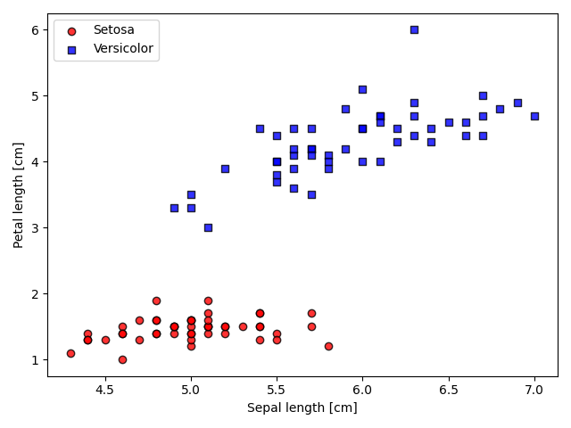
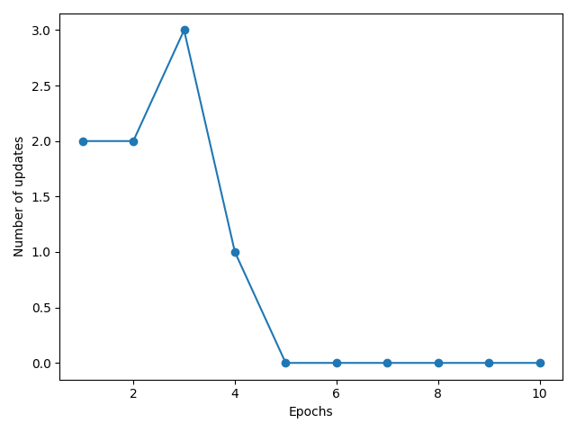
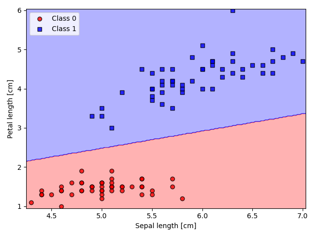

# perceptron-playground

[](https://github.com/grthomson/perceptron-playground/actions/workflows/ci.yml)

Experiments with perceptrons with a view to entity resolution modelled as binary classification. Currently running a simple single-layer model on the Iris dataset, to be extended to multilayer versions. Includes analytics, visualisation and research playground.

## Acknowledgements

This project is heavily based on examples from the excellent book
[**Python Machine Learning, 3rd Edition**, by Sebastian Raschka](https://github.com/rasbt/python-machine-learning-book-3rd-edition).

## Getting started

Create a virtual environment and install dependencies:

```bash
python -m venv .venv && source .venv/bin/activate   # Windows: .venv\Scripts\activate
pip install -e ".[dev]"
pre-commit install
```

## Visualisations

Classic iris dataset outputs (code heavily borrowed from [Raschka](https://github.com/rasbt/python-machine-learning-book-3rd-edition))

### Raw Data Scatter


### Learning Curve
Shows convergence: number of weight updates per epoch.


### Decision Regions
Linear decision boundary learned by the perceptron on two Iris features.

