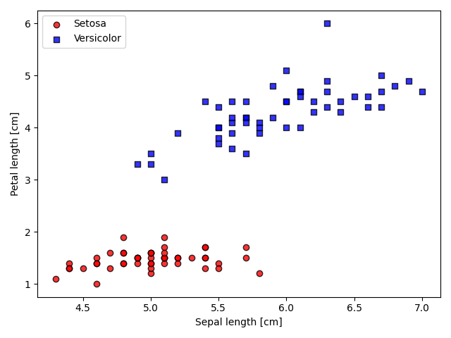
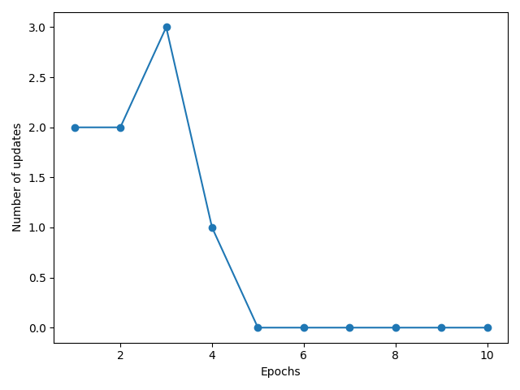
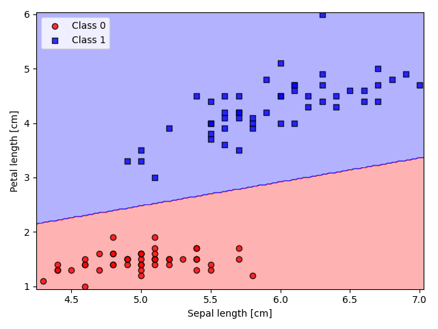
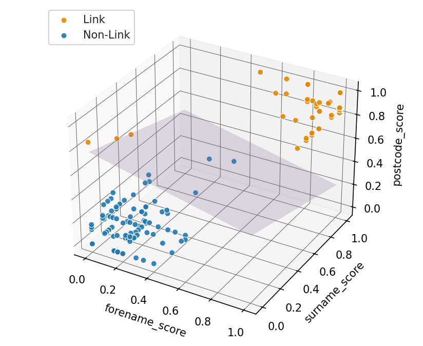

# perceptron-playground

[](https://github.com/grthomson/perceptron-playground/actions/workflows/ci.yml)

Experiments with perceptrons for entity resolution, modelled as binary classification.
Currently includes:
1. A simple single-layer perceptron for classifying the classic Iris dataset.
2. The same perceptron adapted to the toy entity resolution task of matching a noisy dataset to its clean version.

## Acknowledgements

This project is heavily based on examples from the excellent book
[**Python Machine Learning, 3rd Edition**, by Sebastian Raschka](https://github.com/rasbt/python-machine-learning-book-3rd-edition).

## Entity Resolution (Record Linkage) — Quick Start

```bash
# 0) Setup (create venv, install deps, enable pre-commit)
python -m venv .venv
# Git Bash:   source .venv/Scripts/activate
# PowerShell: .venv\Scripts\Activate.ps1
# cmd.exe:    .venv\Scripts\activate.bat
pip install -e ".[dev]"
pre-commit install

# 1) (Optional) Sanity-check with the classic Iris demo
python scripts/train_and_run_iris_perceptron.py

# 2) Generate a small synthetic people dataset (deterministic with Faker)
python scripts/make_toy_clean_dataset.py            # -> data/toy_people_clean.csv

# 3) Create a noisy “duplicate” copy + alignment labels
python scripts/make_noisy_copy.py                   # -> data/toy_people_noisy.csv, data/toy_labels.csv

# 4) Train a perceptron for entity resolution (Levenshtein similarity features)
python scripts/train_linkage_perceptron.py --cols forename,surname,address,city,postcode
# -> saves model to data/models/linkage_perceptron.pkl and prints weights/updates

# 5) Score pairs with the trained model (writes a scored pairs CSV)
python scripts/run_linkage_perceptron.py            # -> data/toy_scored_pairs.csv
```

## What those steps do

1. **Setup:** Creates a virtual environment, installs the project and dev dependencies, and enables local pre-commit hooks.
2. **Iris demo (optional):** Trains on two Iris features and produces three diagnostic plots (scatter, convergence, decision regions) to validate perceptron behaviour.
3. **Make toy data:** Generates a small synthetic dataset (`toy_people_clean.csv`) using Faker, seeded for reproducibility.
4. **Make noisy copy:** Introduces realistic errors (typos, case changes, postcode spacing, etc.) to create `toy_people_noisy.csv`, along with alignment labels in `toy_labels.csv`.
5. **Train entity resolution perceptron:** Builds normalized Levenshtein similarity features for selected columns and learns a linear decision rule (weights + bias).
6. **Score pairs:** Applies the trained model to all candidate pairs (the Cartesian product of clean and noisy data) and writes `toy_scored_pairs.csv` with scores and predictions.

Generated CSVs and model artifacts under `data/` are ignored by git (see `.gitignore`). All scripts to recreate them live under `scripts/`.

## Visualisations

Plotting helpers are kept in ```src/viz/plot.py```.

Classic iris dataset outputs (code heavily borrowed from [Raschka](https://github.com/rasbt/python-machine-learning-book-3rd-edition))

### Raw Data Scatter


### Learning Curve
```
from viz.plot import plot_learning_curve
plot_learning_curve(ppn.errors_)
```
Shows convergence: number of weight updates per epoch.


### 2D Decision Regions
```
from viz.plot import plot_decision_regions_2d
plot_decision_regions_2d(
    X, y, classifier=ppn, feat_idx=(0, 1),
    feature_names=("forename_sim", "surname_sim"),
)
```
Linear decision boundary learned by the perceptron on two Iris features.


## Entity Resolution Visualisations

### 3D decision plane (only when training on exactly three features):

```
from viz.plot import plot_decision_plane_3d
plot_decision_plane_3d(
    X, y, classifier=ppn, feat_idx=(0, 1, 4),
    feature_names=("forename_sim", "surname_sim", "postcode_sim"),
)
```



### 2D decision regions (choose any two features, e.g. forename_sim vs surname_sim):

For models with 4–5 features, the decision boundary cannot be visualised in 3 dimensional Euclidean space. Current plan is to add a Principal Component Analysis (PCA) projection step and provide some meaningful plot using the reduced dimensions.

## CI

This project uses **GitHub Actions** for continuous integration.

Every push to `main` or `develop` (and all pull requests) trigger the CI workflow, which runs on multiple Python versions (`3.10`, `3.11`, `3.12`). The pipeline:

- Installs the package with development dependencies
- Runs **ruff** and **black** for linting and formatting checks
- Runs **mypy** for static type checking
- Executes the test suite with **pytest**

You can find the workflow configuration in [`.github/workflows/ci.yml`](.github/workflows/ci.yml).
